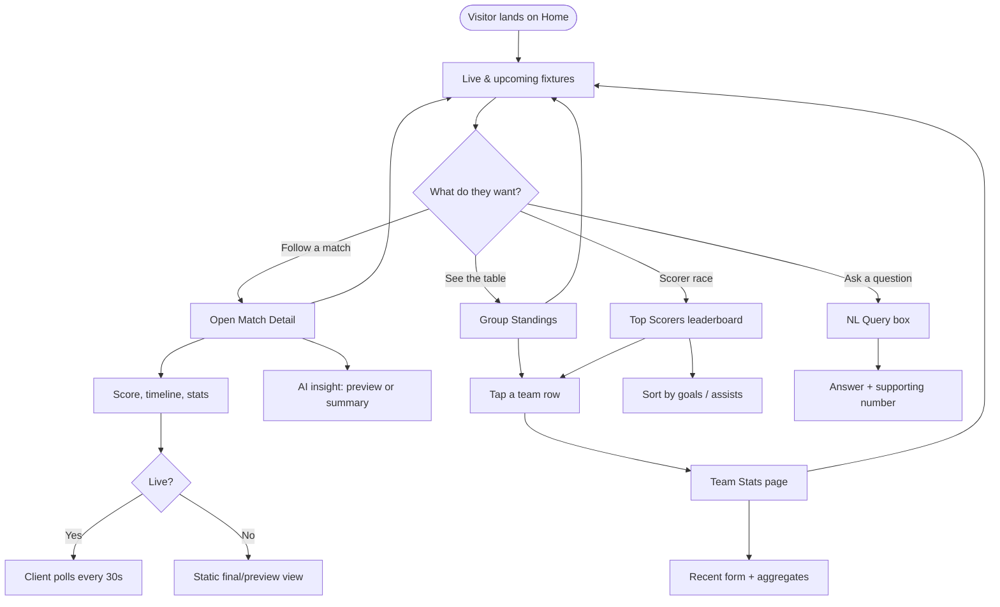
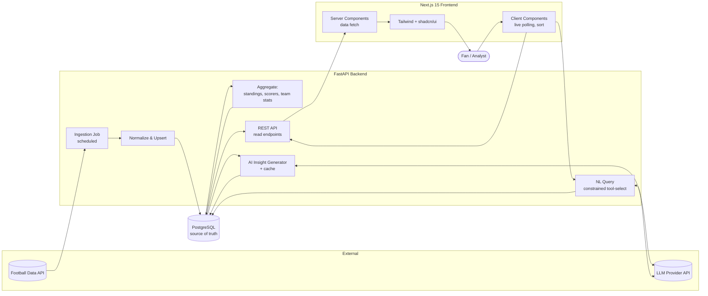

# FIFA World Cup Intelligence Dashboard — Product Requirements Document

**Version:** 1.0 (MVP)
**Status:** Draft for build
**Author:** Sammar
**Type:** Portfolio project
**Target build time:** 1 day (deployable)

---

## 1. Overview

A web dashboard that pulls live and historical FIFA World Cup data from a third-party football API, processes it through a FastAPI backend, persists it in PostgreSQL, and presents it through a fast, polished Next.js frontend. On top of the raw data sits a small **AI insights layer** that turns numbers into readable analysis (match previews, form summaries, and a natural-language query box).

The project is deliberately scoped so that the four skills it advertises are each visibly demonstrated:

| Skill claimed | Where it shows up |
|---|---|
| AI engineering | LLM-generated match insights + natural-language "ask the data" endpoint with prompt design, caching, and structured output parsing |
| API integration | Ingesting and normalizing a rate-limited third-party football API |
| Data processing | ETL pipeline: fetch → normalize → upsert → aggregate (standings, top scorers, team stats) |
| Dashboard development | Responsive Next.js 15 UI with live fixtures, standings, scorers, team and match detail views |

---

## 2. Problem & Goals

### Problem
Football fans and analysts juggle several apps and sites to follow a tournament: one for scores, one for tables, one for stats. None of them explain *what the numbers mean*. Raw stats are everywhere; quick, readable intelligence is not.

### Product goals
1. Give users a single screen to track fixtures, standings, scorers, and team form during the World Cup.
2. Layer lightweight AI analysis on top of the data so a casual fan gets the "so what."
3. Stay fast and read-only — no login, no friction.

### Portfolio goals (the real driver)
- Ship something end-to-end and deployed within a day.
- Make each engineering competency legible to a reviewer skimming the repo and the live demo.

### Non-goals (MVP)
- No user accounts, profiles, favorites, or notifications.
- No betting odds, predictions markets, or money features.
- No write operations from users (read-only product).
- No mobile native app (responsive web only).
- No real-time websockets (polling is enough for MVP).

---

## 3. Target Users

| Persona | Needs | What they do on the dashboard |
|---|---|---|
| **Casual fan ("Sam")** | Quick scores and a plain-English read on what's happening | Glances at live fixtures, taps a match for a summary, reads AI match preview |
| **Analyst / data-curious fan ("Ravi")** | Standings, scorer races, and comparable team stats | Filters by group, sorts scorer table, opens team stat pages, uses the NL query box |

Both are anonymous visitors. Both arrive expecting it to load fast and work on a phone.

---

## 4. Scope

### In scope (MVP)
- Live & upcoming fixtures with status (scheduled / live / finished) and score.
- Group stage standings tables.
- Top scorers leaderboard.
- Team statistics page (per team aggregates).
- Match detail view (lineups if available, goals, key stats).
- AI match insight (auto-generated preview/summary per match).
- AI natural-language query box ("Which team has scored the most in the second half?").
- Auto-refreshing data via scheduled ingestion.

### Out of scope (MVP, candidate for v2)
- Player-level deep profiles, historical tournaments, knockout bracket visualizer, multi-language, dark/light theme toggle (ship one theme), websockets, user favorites.

---

## 5. Features & Requirements

Each feature lists user-facing behavior and acceptance criteria.

### 5.1 Live Fixtures
**Behavior:** Home page lists fixtures grouped by day. Live matches surface at the top with a "LIVE" badge and current score; finished matches show final score; upcoming show kickoff time in the user's local timezone.

**Acceptance criteria**
- Fixtures load in under 1.5s (served from DB, not live API call on request).
- Live matches refresh on the client every 30s.
- Each fixture card links to its match detail page.
- Empty/no-match days render a friendly empty state, not a blank screen.

### 5.2 Group Standings
**Behavior:** Tabbed or selectable group tables showing P, W, D, L, GF, GA, GD, Pts, sorted by tournament tiebreak rules (points, then goal difference, then goals for).

**Acceptance criteria**
- All groups available from one page.
- Each team row links to its team page.
- Standings recompute from match results during ingestion (not hand-entered).

### 5.3 Top Scorers
**Behavior:** Leaderboard of players by goals, with assists and team shown. Sortable by goals (default) and assists.

**Acceptance criteria**
- Shows player name, team, goals, assists, matches played.
- Ties broken by fewer matches played, then assists.
- Sort is client-side and instant once data is loaded.

### 5.4 Team Statistics
**Behavior:** Per-team page with aggregate stats: matches played, goals for/against, possession avg, shots, cards, clean sheets, recent form (last 5 results as W/D/L chips).

**Acceptance criteria**
- Reachable from standings and fixtures.
- Stats are aggregated server-side from match data.
- Missing stat fields degrade gracefully (show "—", never crash).

### 5.5 Match Details
**Behavior:** Single match page: teams, score, status, venue, goal timeline, basic stats (possession, shots, corners, cards), lineups if the API provides them.

**Acceptance criteria**
- Deep-linkable URL (`/match/[id]`).
- Renders for scheduled (preview mode), live, and finished states.
- Shows the AI insight block (see 5.6).

### 5.6 AI Match Insights *(the AI engineering showcase)*
**Behavior:** For each match, generate a short (2–4 sentence) natural-language insight:
- **Pre-match:** form-based preview ("X enters unbeaten in 3, but concedes early...").
- **Post-match:** result summary highlighting the decisive stat.

**Implementation notes**
- Backend builds a structured prompt from DB stats (not free-form scraping) and calls an LLM.
- Output is **cached in PostgreSQL** keyed by match + state, so it's generated once per state change, not per page view. This keeps cost and latency down and is the main reason it fits in a day.
- Insight generation runs in the ingestion job, not on the request path.

**Acceptance criteria**
- Every match in a finished/scheduled state has a cached insight.
- Insight never blocks page render — if absent, the block is hidden.
- Prompt and model are configurable via env vars.

### 5.7 AI Natural-Language Query *(stretch within MVP)*
**Behavior:** A search box where a user types a question; backend translates it into a constrained query over a fixed set of pre-defined aggregates (not arbitrary SQL) and returns an answer with the supporting number.

**Implementation notes**
- Use a **constrained / tool-style** approach: the LLM selects from a whitelist of known queries and parameters rather than generating raw SQL — safer and demo-stable.
- Falls back to "I can't answer that yet" rather than hallucinating.

**Acceptance criteria**
- Handles ~8–10 supported question patterns reliably.
- Returns the numeric evidence alongside the sentence.
- Out-of-scope questions get an honest refusal, not invented stats.

> If time runs short on day 1, 5.7 is the first thing to cut to a "coming soon" state. 5.6 stays — it's the core AI demonstration.

---

## 6. Non-Functional Requirements

- **Performance:** p95 page load < 1.5s; API responses served from DB, < 200ms typical.
- **Reliability:** Frontend never depends on a live third-party call at request time. If ingestion fails, the dashboard shows last-known data.
- **Rate limits:** Respect the football API's quota; ingestion is scheduled and cached, never per-user.
- **Cost control:** AI calls are cached and triggered only on data changes.
- **Accessibility:** Semantic HTML, keyboard-navigable, sufficient contrast (shadcn/ui defaults help here).
- **Responsive:** Works phone → desktop.
- **Observability (lightweight):** Structured logs on the ingestion job; a `/health` endpoint.

---

## 7. Tech Stack

| Layer | Choice | Notes |
|---|---|---|
| Frontend | Next.js 15 (App Router), TypeScript, Tailwind, shadcn/ui | Server Components for data fetching, client components for live polling |
| Backend | FastAPI (Python) | REST endpoints + scheduled ingestion job |
| Database | PostgreSQL | Source of truth for the frontend |
| AI | LLM via provider API | Insight generation + constrained NL query; configurable model |
| Data source | Third-party football API (e.g. API-Football / football-data.org) | Single integration, normalized on ingest |
| Scheduler | APScheduler (in-process) or a cron/external trigger | In-process is simplest for 1-day scope |
| Deploy | Frontend → Vercel; Backend + DB → Railway/Render/Fly | Managed Postgres to save setup time |

---

## 8. Data Model (initial schema)

```
teams         (id, name, code, group_label, flag_url)
players       (id, name, team_id, position)
fixtures      (id, home_team_id, away_team_id, kickoff_at, venue,
               status, home_score, away_score, group_label, round)
match_stats   (id, fixture_id, team_id, possession, shots, shots_on_target,
               corners, fouls, yellow_cards, red_cards)
goals         (id, fixture_id, player_id, team_id, minute, type)
standings     (id, team_id, group_label, played, won, drawn, lost,
               goals_for, goals_against, goal_diff, points)   -- derived
scorer_stats  (id, player_id, goals, assists, matches_played)  -- derived
ai_insights   (id, fixture_id, state, content, model, created_at)  -- cached
```

Derived tables (`standings`, `scorer_stats`) are recomputed each ingestion run from the raw fixtures/goals data — this is the visible "data processing" piece.

---

## 9. API Design (FastAPI endpoints)

| Method | Endpoint | Returns |
|---|---|---|
| GET | `/health` | service status |
| GET | `/fixtures?date=&status=` | list of fixtures |
| GET | `/fixtures/{id}` | single match with stats, goals, insight |
| GET | `/standings?group=` | standings tables |
| GET | `/scorers` | top scorers leaderboard |
| GET | `/teams/{id}` | team aggregate stats + recent form |
| POST | `/query` | `{question}` → `{answer, evidence}` (NL query) |
| POST | `/ingest` *(internal/secured)* | trigger ingestion + aggregation + insight gen |

All GET endpoints read from PostgreSQL only.

---

## 10. User Flow



---

## 11. Architecture



**Key architectural decision:** the frontend never calls the football API or the LLM on the request path. Both are touched only by the scheduled ingestion job, with results cached in Postgres. This makes the app fast, cheap, rate-limit-safe, and demo-stable — and it's what makes the 1-day target realistic.

---

## 12. Data Pipeline (the "data processing" story)

1. **Fetch** — Scheduled job calls the football API (fixtures, results, stats).
2. **Normalize** — Map API shapes to internal schema; handle nulls and naming.
3. **Upsert** — Insert/update teams, fixtures, goals, match_stats by external ID.
4. **Aggregate** — Recompute standings (with tiebreak rules), scorer leaderboard, team aggregates.
5. **Enrich** — Generate AI insights for matches whose state changed; cache them.
6. **Serve** — REST endpoints read the finished tables.

Runs on a schedule (e.g. every 1–2 minutes during live windows, less often otherwise).

---

## 13. One-Day Build Plan

| Block | Time | Output |
|---|---|---|
| Setup | ~1h | Repos, Postgres provisioned, env vars, schema migrated |
| API integration + ingest | ~2h | Working fetch → normalize → upsert for fixtures/teams/goals |
| Aggregation | ~1.5h | Standings, scorers, team stats computed and stored |
| Backend endpoints | ~1h | All GET endpoints returning real data |
| AI insights | ~1.5h | Prompt + cached insight generation in the job |
| Frontend core | ~3h | Home/fixtures, standings, scorers, team, match pages |
| NL query *(stretch)* | ~1h | Constrained query endpoint + search box |
| Deploy + polish | ~1.5h | Vercel + backend/DB deployed, smoke-tested, README |

**Cut order if behind:** NL query (5.7) → team stat depth → match lineups. Never cut: fixtures, standings, scorers, and at least one AI insight feature.

---

## 14. Risks & Mitigations

| Risk | Mitigation |
|---|---|
| Football API quota/limits | Cache everything in DB; ingest on schedule, never per request |
| API has no live World Cup data window | Pinned/seeded dataset fallback so the demo always shows content |
| AI cost/latency | Generate once per state change, cache in DB, configurable model |
| AI hallucination in NL query | Constrained tool-select over whitelisted queries; honest refusal fallback |
| Scope creep blowing the 1-day budget | Strict MVP cut list (section 13) |
| Deploy surprises | Use managed Postgres + Vercel; reserve final 1.5h for deploy |

---

## 15. Success Metrics

Since there's no auth/analytics requirement for MVP, success is demo- and portfolio-oriented:
- Live deployed URL loads in < 2s and shows real (or seeded) tournament data.
- All five core features reachable and functional.
- At least one AI feature visibly working on the live demo.
- README explains the architecture and the four demonstrated competencies.
- Reviewer can trace the data path from API → DB → UI in the repo.

*(Optional if time permits: drop in a privacy-light analytics snippet to track page views and most-viewed match.)*

---

## 16. Future Enhancements (post-MVP)

- Knockout bracket visualizer and live win-probability.
- Player profile pages and head-to-head comparisons.
- WebSocket live updates instead of polling.
- Historical tournaments and cross-tournament comparisons.
- User favorites + notifications (would introduce auth).
- Richer NL query with charting of the answer.
